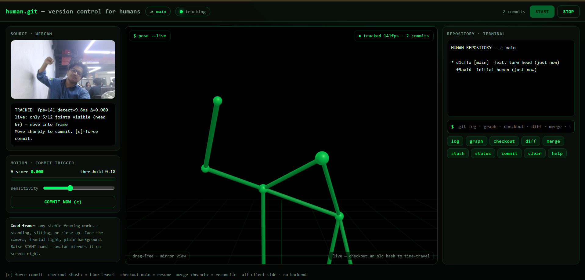
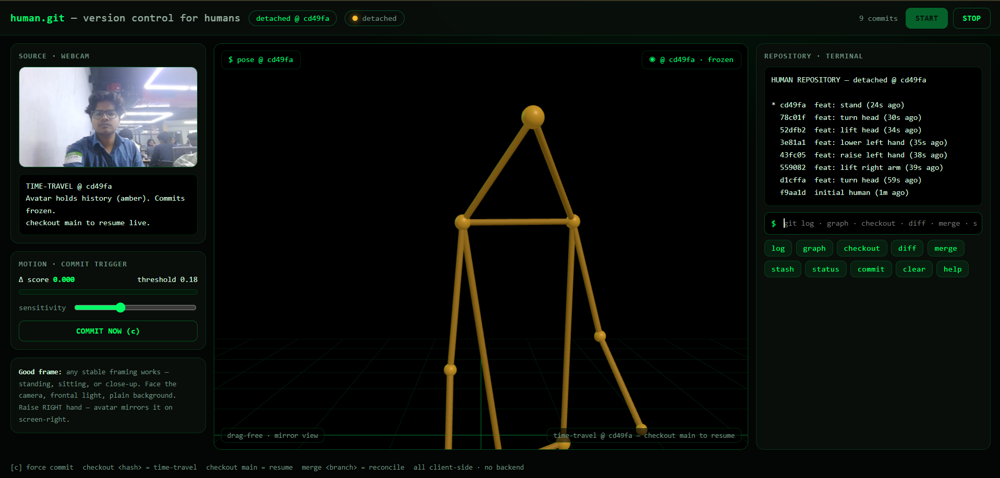
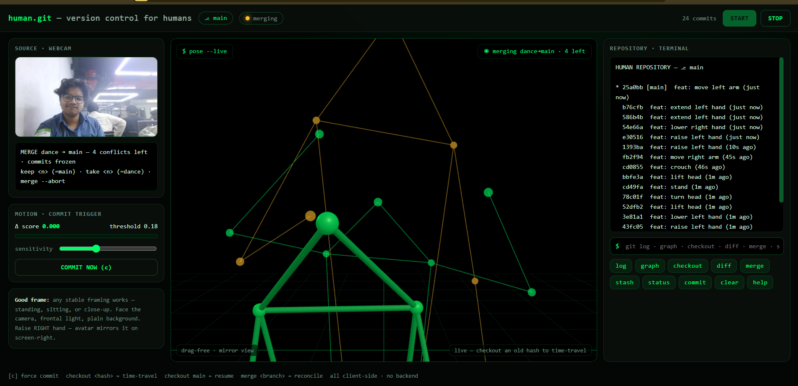
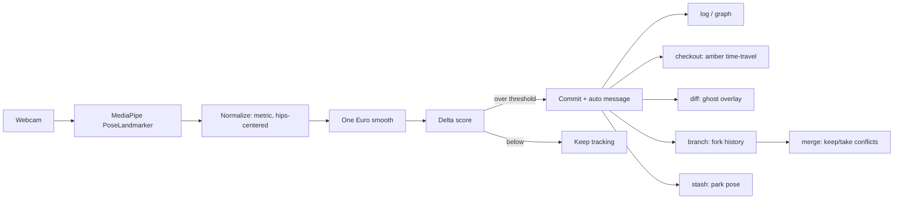

# human.git 🎯
### *Version control for humans. Nobody asked for it.*

## Basic Details
### Team Name: TimeToLOQin

### Team Members
- Team Lead: Ansil Muhammed N S - KMEA Engineering College 


### Project Description
human.git puts your body under Git version control. A webcam tracks your pose in the browser, significant movements become commits, and you run `log`, `checkout`, `diff`, `branch`, and `merge` on yourself — including human merge conflicts. All client-side, no backend.

### The Problem (that doesn't exist)
Source code has commits, branches, diffs, and merges — but the human body, arguably the buggiest runtime ever shipped, has zero version control. Nobody can check out yesterday's posture, diff two dance moves, or resolve a conflict between standing and crouching.

### The Solution (that nobody asked for)
Point a webcam at yourself and become a repository: MediaPipe pose tracking plus a from-scratch Git engine in JavaScript turns every raise, turn, and crouch into a commit on a 3D avatar. Branch your dance moves, merge them back, and argue with yourself when your arms disagree. Nobody needed it. That's the point.

## Technical Details
### Technologies/Components Used
For Software:
- **Languages:** JavaScript (ES modules), HTML, CSS — no TypeScript, no build step
- **Frameworks:** None (vanilla JS, zero dependencies to install)
- **Libraries:** Three.js `0.160.0` (3D avatar + overlays), MediaPipe Tasks Vision `0.10.14` (in-browser pose detection, 33 landmarks + world coordinates)
- **Tools:** Python `http.server` (static serving), Chrome/Edge (webcam + WebGL), Git/GitHub, GitHub Pages workflow (`.github/`, auto-deploys this repo)

For Hardware:
- Not applicable — pure browser software. Any laptop with a webcam works.

### Implementation
For Software:
### Installation
None. Clone and serve — there is nothing to `npm install`, nothing to build:
```bash
git clone https://github.com/ClashLex/human.git
```

### Run
```bash
python3 -m http.server 8000
# open http://localhost:8000 → click START → allow camera → hold still 1 s
```
Webcams require a secure context: `localhost` or HTTPS. Then move sharply — raises, turns, crouches land in `log` as commits.

### Features & Commands
| Command | What it does |
|---|---|
| `log` / `graph` | Movement history (HEAD lineage / all branches with merge edges) |
| `checkout <hash\|branch>` | Time-travel to an old pose (amber, detached) / resume live |
| `diff [<a> [<b>]]` | Joint-by-joint compare + green/amber ghost overlay |
| `branch [<name>]` | Fork movement history (`-d` deletes) |
| `merge <branch>` | Reconcile histories; conflicts resolved with `keep`/`take` |
| `stash` | Park a pose, `pop` to preview it |
| `status`, `commit`, `clear`, `help` | State, force-commit, wipe view, command list |

### Repo Structure
| Path | Role |
|---|---|
| `index.html` | UI shell: topbar, source column, 3D stage, terminal |
| `src/main.js` | Boot + render loop wiring |
| `src/tracking.js` | Detection loop, One Euro commit engine, adaptive perf |
| `src/commands.js` | All terminal commands + safety guards |
| `src/ui.js` | Log/graph rendering, meters, status |
| `src/pose.js` | Metric normalization, scoring, visibility gates |
| `src/filters.js` | One Euro adaptive smoothing filter |
| `src/git.js` | Commits, branches, HEAD, stash, checkout |
| `src/merge.js` | Merge analysis + two-parent conflict finalize |
| `src/diff.js` | Joint-by-joint diff + text report |
| `src/messages.js` | Auto commit messages + live debug readout |
| `src/avatar.js` | Three.js avatar, tweens, ghost overlays |

### Project Documentation
For Software:

### Screenshots (capture from a live session: tracking, time-travel, merge conflict)

*Green avatar mirroring the user, log filling with commits, Δ meter active*


*Amber avatar holding an old pose, `detached @ <hash>` badge, frozen HUD*


*Green vs amber ghosts overlaid, conflict list in the terminal*

### Diagrams

*Webcam frames become commits; every Git operation reads the same commit store.*

### Project Demo
### Video
[https://drive.google.com/file/d/1jeXzzhLZS_ZYWnzbw6_j_HV8VokwxVzc/view?usp=drivesdk]
*Shows: live commits landing, amber time-travel, green/amber merge conflict and resolution*

### Additional Demos
[Any extra clips, GIFs, 
live link - https://clashlex.github.io/useless_project_temp/


---
Made with ❤️ at TinkerHub Useless Projects


